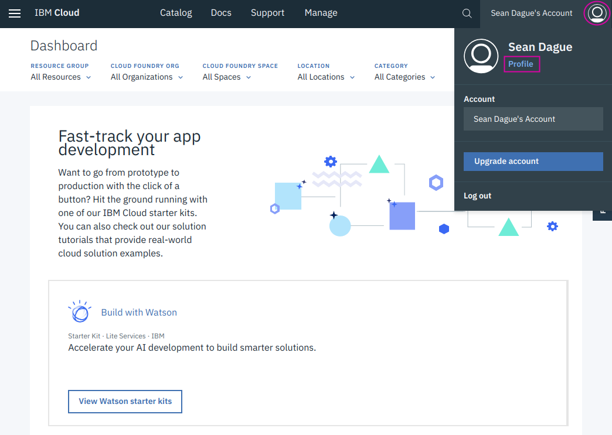
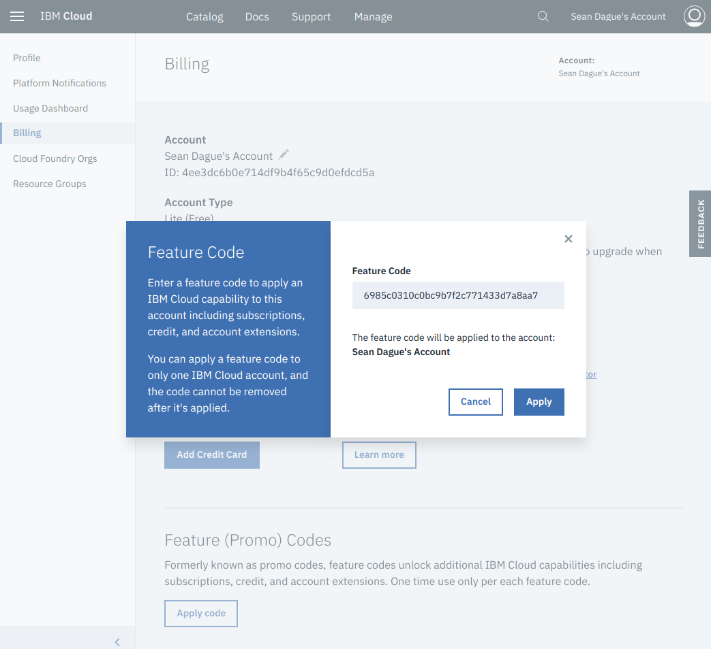
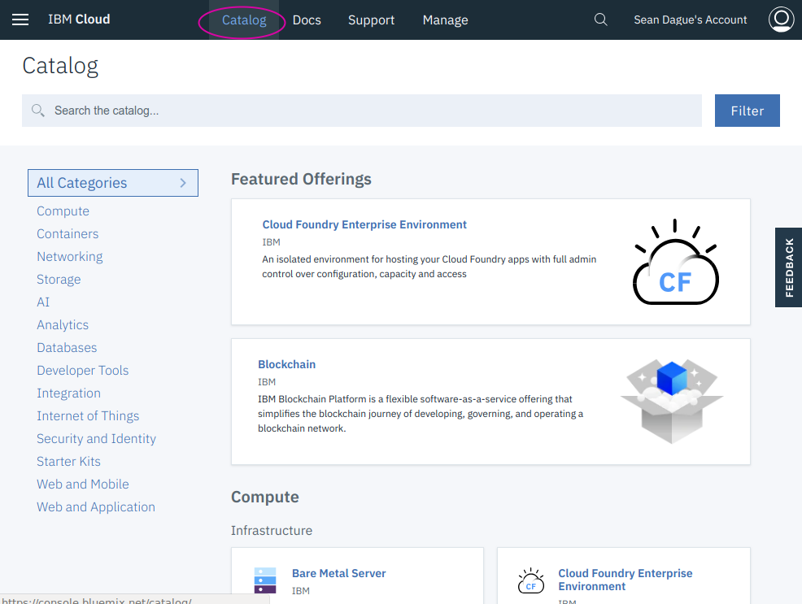
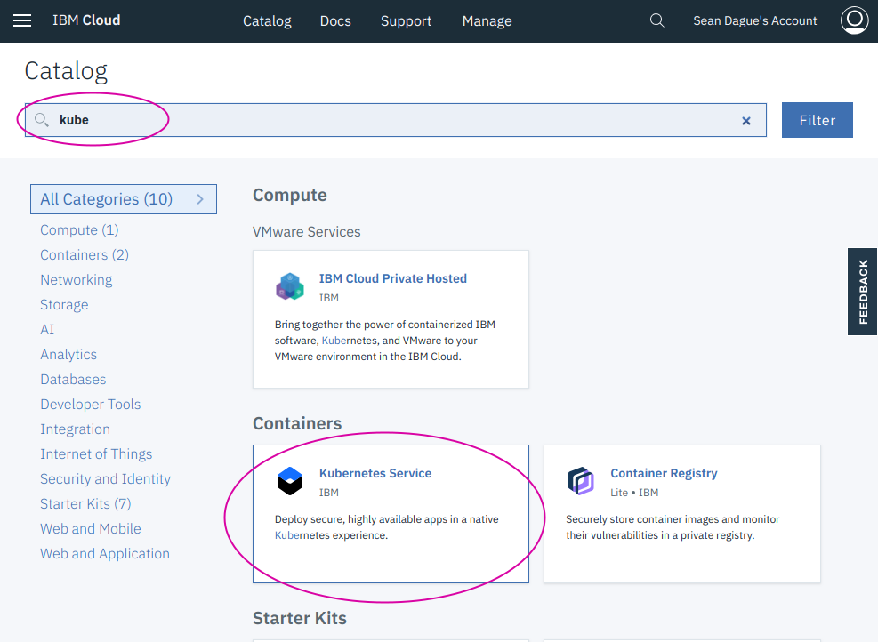
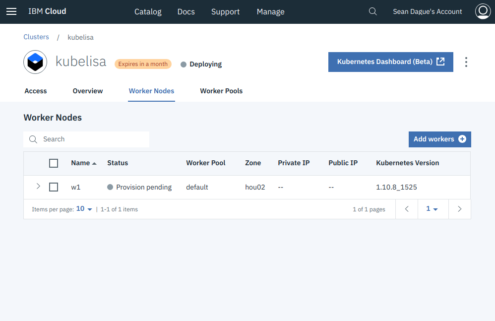

# Setup Instructions for IBM Cloud Account

In order to complete the Kubernetes 101 workshop at LISA you'll need
the ability to provision a Kubernetes Cluster. We are providing IBM
Cloud Accounts with Promo codes to do this. This is a detailed walk
through of that process.

## Step 1: Register for IBM Cloud with the LISA url

Go to https://ibm.biz/kube101-lisa to start the registration.

Fill out all the require information and the CAPTCHA and
submit. You'll get a confirmation page like:

## Step 2: Confirm Email

Check your email and confirm your account. This will take you to an
IBM coders site. You can ignore this.

## Step 3: IBM Cloud Console

Navigate to the [Dashboard](https://console.bluemix.net/dashboard/apps/)

It will ask you to login:

## Step 4: Add Promo Code

Click on the upper right icon that looks like a "person", and click on
the **Profile** link.

From the profile page click on the [Billing](https://console.bluemix.net/account/billing)

You will be getting a Promo Code from the Google Drive link specified
in the workshop. Take one from there. Add it with the Add Promo Code
Screen.

## Step 5: Provision Kube Cluster

First navigate to the [Catalog](https://console.bluemix.net/catalog/).

There are lots of services available here, so the best bet is to start
typing ``kube`` in the search field to find the IBM Kubernetes
Service.

Click on Create.

Create a cluster. Be sure to do the following things:

* Set the region to **US South**
* Select Free Cluster
* Name the cluster **kubelisa**

You can name it anything you want, but the commands examples use
kubelisa as the name for consistency.

Then click on create.

Afterwards you can see the status of the cluster here

